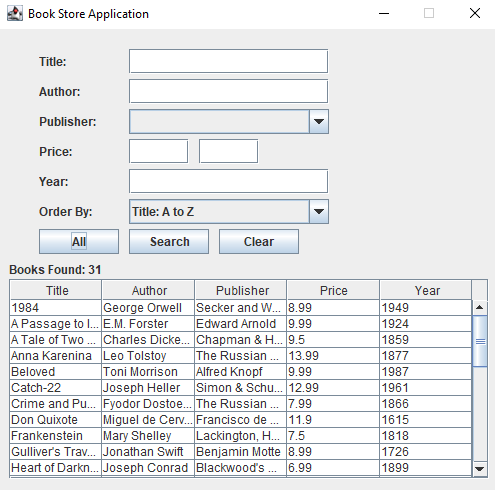

# CS105 Project: Book Store Application

## Introduction
This project is part of the CS105 Introduction to Object Oriented Programming course at Özyeğin University. It involves developing a Java Swing application for managing a bookstore, showcasing GUI and backend management functionalities.

## Purpose
The project demonstrates Java Swing for GUI development and reinforces object-oriented programming principles, providing practical experience in designing and implementing interactive applications.

## Project Components
- **BookManager Class**: Manages book-related operations like loading and searching.
- **MainPanel Class**: Handles the GUI and user interactions with various Swing components.
- **Controller Class**: Connects the GUI to the data model, managing user actions and interface updates.
- **Book Class**: Represents the data and attributes of a book.

## Usage
The application utilizes Java Swing to showcase GUI development, event handling, and dynamic data management. The architecture employs key OOP principles such as encapsulation and polymorphism to ensure the code is maintainable and extensible.

## Design of the Application

## Acknowledgements
Designed by Esma Meral for the CS105 Introduction to Object Oriented Programming course at Özyeğin University, this project helps students learn and apply Java programming and GUI design in a real-world context.
